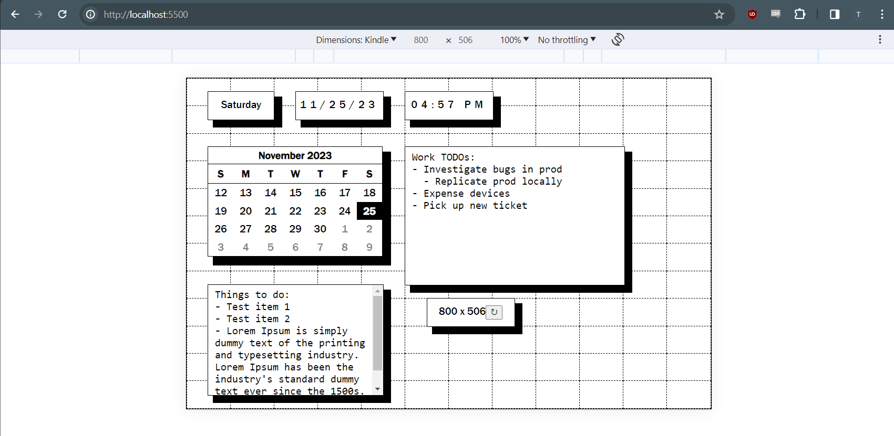

## About
POC for a dashboard website to be ran on legacy Kindle 4 device's experimental browser.

Uses Babel, WebPack, and some hand-rolled Polyfills to use some modern JS features. Output gets compiled into `./dist/main.js`

Uses JSDocs + some TypeScript features to provide type hints (tested working in VSCode only).



## Running

```sh
yarn install

# yarn build OR
yarn dev
```

Serve `index.html` (served using VSCode live server extension currently) & open in the Kindle browser.

Use one of the horizontal orientations - resolution is 800 x 506 px.

